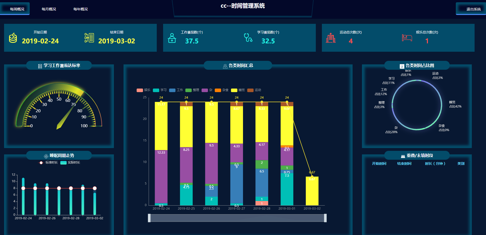

# 个人时间管理系统

## 1.软件功能
本项目主要为统计个人时间花费、对个人习惯分析的软件。让人能直观的看到自己时间都花到什么上了，辅助人改变自己的习惯

## 2. 安装环境、启动命令
环境
- Python3.6

安装命令：
```
pip install r requirements.txt
```

启动命令：
```
cd person_time_manage_system
python3 app.py
```

打开网址: ```http://<IP>:5601/timesum/<用户名>```， 如下图：




## 3. 使用说明


## 4. 代码目录结构说明
```
├── _doc
├── person_time_manage_system
│   ├── app.py
│   ├── data
│   │   ├── base.conf
│   │   ├── client_id.json
│   │   ├── client_secret.json
│   │   └── users_info.json
│   ├── static
│   │   ├── fonts
│   │   ├── images
│   │   ├── scripts
│   │   └── styles
│   ├── templates
│   └── tools
├── README.md
├── requirements.txt
├── setup.py
```

## 5. 常见问题


## 6. 后续开发计划
- 优化web，把icon换为更切合主题的图
- 增加用户注册功能，关联google账户
- 增加缓存层，提高web响应速度
- 增加 "每月概况"，"年度报表"、"习惯分析" 等web可视化界面
- 除google日历外，增加更多日历服务，