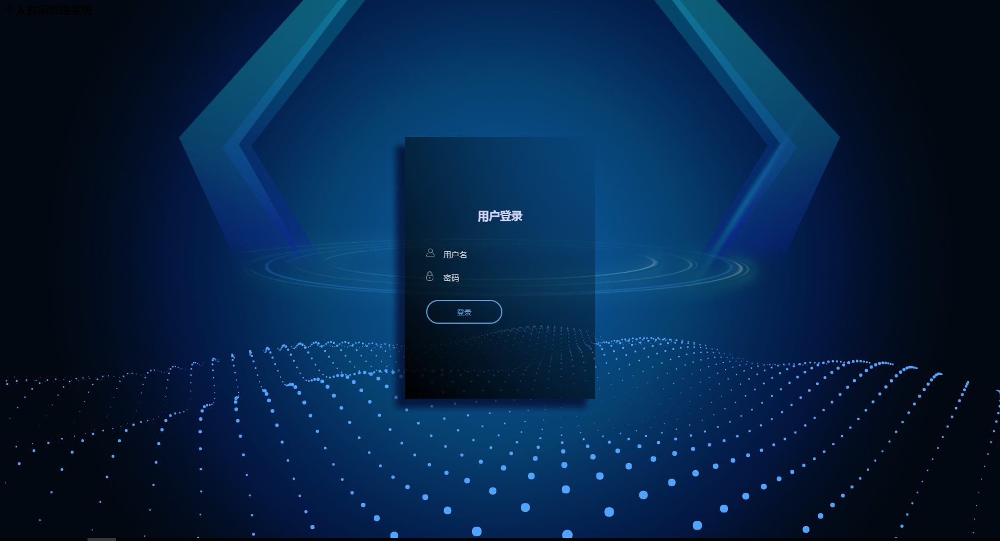
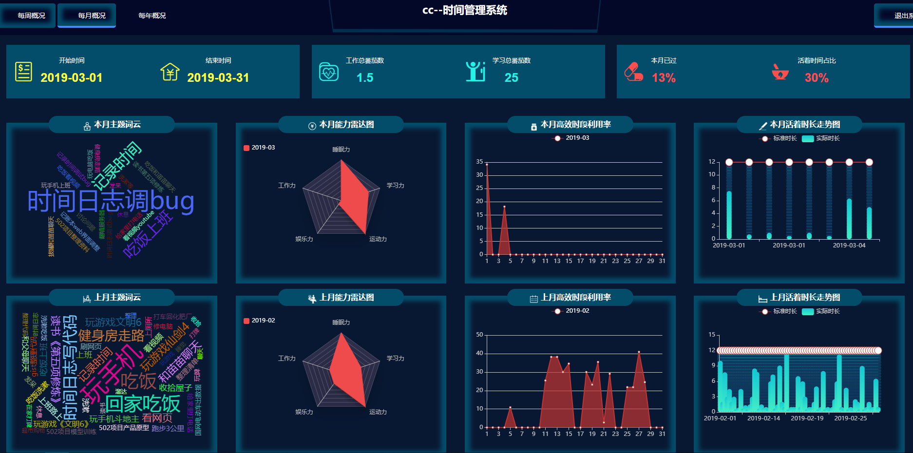
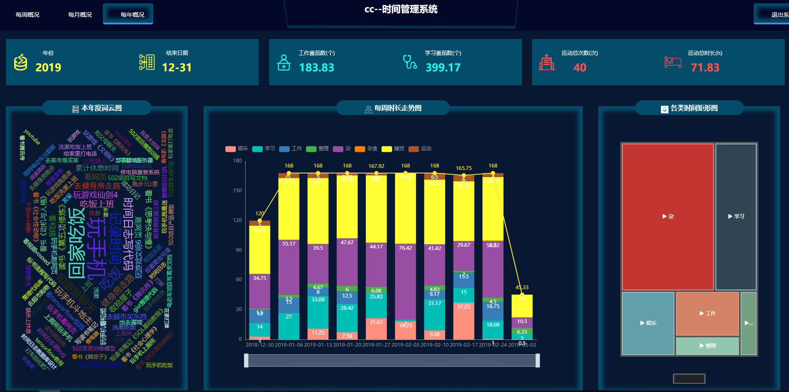

# 个人时间管理系统

## 1.软件功能
本项目主要为统计个人时间花费、对个人习惯分析的软件。让人能直观的看到自己时间都花到什么上了，辅助人改变自己的习惯

## 2. 安装环境、启动命令
环境
- Python3.6

打包工程：
```
python setup.py sdist --dist-dir _bin
```
或者
```
python setup.py bdist_wheel --dist-dir _bin
```

安装依赖命令：
```
pip install -r requirements.txt
```

启动命令：
```
cd person_time_manage_system
python3 app.py
```

打开网址: ```http://<IP>:9001/login```，(样例网址：```http://www.timesum.top:9001/``` ) 如下图：









## 3. 使用说明


## 4. 代码目录结构说明
```
./
├── _bin
├── _doc
├── person_time_manage_system
│   ├── app.py
│   ├── data
│   │   ├── base.conf
│   │   ├── client_secret.json
│   │   └── sqlit3.db
│   ├── static
│   │   ├── favicon.ico
│   │   ├── images
│   │   ├── scripts
│   │   └── styles
│   ├── templates
│   └── tools
│       ├── BussinessLogic.py
│       ├── CacheCalcTools.py
│       ├── CalenderTools.py
│       ├── DateTools.py
│       ├── Entity.py
│       ├── GoogleAuth.py
│       ├── __init__.py
│       ├── restful.py
│       └── SqlTools.py
├── README.md
├── requirements.txt
└── setup.py

```

## 5. 常见问题


## 6. 后续开发计划
- 优化web，把icon换为更切合主题的图
- 增加用户注册功能，关联google账户
- 增加 "习惯分析" 等web可视化界面
- 除google日历外，增加更多日历服务，
- favicon.ico 图标显示